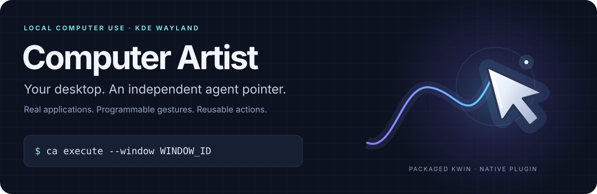
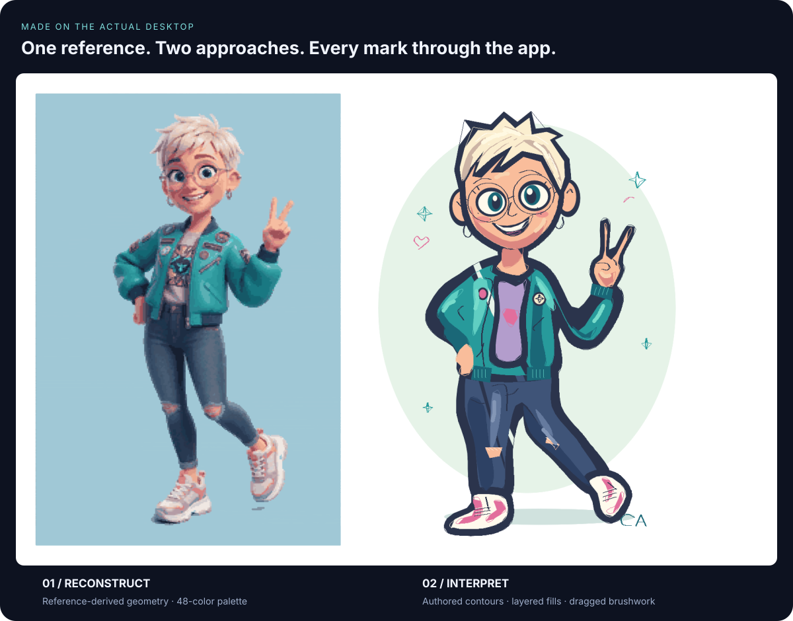
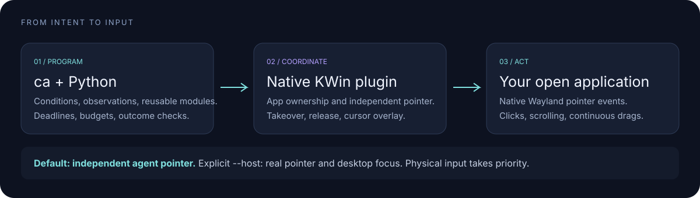

<p align="center">
  
</p>

<p align="center">
  <strong>A local computer-use toolkit for agents that work in your existing applications.</strong><br>
  Built for KDE Wayland, with a native plugin for packaged KWin and a programmable <code>ca</code> CLI.
</p>

<p align="center">
  <a href="#see-it-paint">See it paint</a> ·
  <a href="#try-ca">Try CA</a> ·
  <a href="#teach-it-a-small-action">Computer Memory</a> ·
  <a href="#what-works-today">Current capabilities</a> ·
  <a href="#build-and-test">Build</a>
</p>

## See it paint

<a href="docs/assets/kolourpaint-original.png">
  
</a>

These two paintings were created in an already-open **KolourPaint window on the actual desktop**. CA delivered the drawing input; the reference image was never pasted or imported into the canvas.

- **Left — reconstruct.** A reference-derived painting program reduced the image to a 48-color palette and grouped it into thousands of filled rectangles.
- **Right — interpret.** Authored geometry reimagined the character with larger eyes, bold outlines, a heart motif, and a mint backdrop. Continuous drags, opaque shape fills, and brush highlights built the illustration.

Both runs used screenshot checks and corrections. The second run exposed fill and polygon-tool behavior that needed adjustment; this is a hands-on demonstration, not a claim of unattended reliability across applications.

**[Download the original saved canvas →](docs/assets/kolourpaint-original.png)** · [How this demo was made](docs/PAINTING-DEMO.md)

## A pointer with its own presence


The agent gets a visible silver pointer with a soft halo, a motion trail, an orbiting spark, and click feedback. It is rendered separately from the human cursor. The SVG above illustrates the actual renderer’s geometry and colors; it is not a recording.

A session opens automatically when input is acquired. The agent pointer remains visible between actions until **`ca session close`**. Returning your pointer or keyboard focus to the target application takes control back.

## Try CA

After [building and loading the plugin](plugin/README.md), run `./ca` from this checkout, or use `ca` if it is on your `PATH`.

```bash
ca capabilities
ca windows
ca observe --window WINDOW_ID

ca click --window WINDOW_ID --x 200 --y 150
ca scroll --window WINDOW_ID --x 200 --y 150 --delta 20
ca capture --window WINDOW_ID /absolute/path/new-capture.png

ca session close
```

Keep your pointer and keyboard focus outside the target application's connection before agent input. Capture paths must be new. Read-only commands do not open sessions; there is no `session open` step.

### Give the agent a program, not just a click

On a drawing canvas with a drawing tool selected, send a continuous stroke as one bounded Python program:

```bash
ca execute --window WINDOW_ID --deadline 15 --budget 1000 <<'PY'
import math

def run(ctx):
    points = [
        (240 + 120 * math.cos(t / 30), 220 + 80 * math.sin(t / 30))
        for t in range(190)
    ]
    ctx.path(points, interval=.006)
    return ctx.observe()
PY
```

Coordinates are logical pixels relative to window content. Choose a clear canvas region for your app. `ctx.path` holds the pointer button along the path; this is real application input. An observation lets the caller inspect the result—it does not automatically establish that the intended drawing succeeded.

Programs can branch, wait for observed changes, use guarded regions, compose modules, and record named outcome checks. They share deadlines, request budgets, and application ownership.

**[Explore the programming API →](docs/COMPUTER-MEMORY.md)**

## Teach it a small action

Computer Memory stores **modular Python actions** with typed inputs and immutable versions. Save a useful primitive, then compose it into different tasks.

```bash
ca memory create WINDOW_ID stroke --description "Drag between two canvas points" <<'PY'
CONTRACT = {'requires': ['move', 'button']}

def run(ctx, x1: float, y1: float, x2: float, y2: float):
    ctx.path([(x1, y1), (x2, y2)], interval=.03)
PY

ca memory list WINDOW_ID
ca memory run WINDOW_ID stroke --x1 160 --y1 180 --x2 360 --y2 260
ca session close
```

Modules live under `computer-memory/windows/WINDOW_ID/`. They can declare parameter constraints and window requirements, call other modules, retain version history, and record explicit checks. Registration parses source without executing it. Modules are local Python programs with the user's privileges, not a sandbox.

Use `ca runs show RUN_ID` to inspect an execution record without replaying its actions. The legacy `ca run task.py` API remains available; use `execute` and `memory run` for supervised programs.

## Two lanes, explicit control

| Lane | What it controls | How to select it |
| --- | --- | --- |
| **Agent** | Independent pointer delivery to a native Wayland application | Default `ca …` |
| **Host** | The real desktop pointer and normal desktop focus | Explicit `ca --host …` |

```bash
ca --host focus --window CHAT_ID
ca --host click --window OTHER_APP_ID --x 300 --y 200
ca session status
ca session close
```

The lanes can work in **different Wayland connections**. Windows sharing one connection cannot be owned by both lanes. Physical input interrupts host automation. There is no silent fallback from agent input to the human pointer.

A dialog can activate itself and interrupt agent input. Explicit host focus can help recover from a supported native dialog; it does not prevent activation or provide general popup support.

**[Host control, takeover, and parallel programs →](docs/HOST-LANE.md)**

## How it fits together



The plugin builds against the installed KWin development headers. It delivers agent events to a client's existing Wayland pointer resources and draws a separate cursor overlay. The explicit host lane uses KWin's normal pointer pipeline.

**No KWin fork is required.** This is pointer separation, not a complete additional Wayland seat. KWin plugin compatibility still requires rebuilding for KWin releases.

The local control socket defaults to `$XDG_RUNTIME_DIR/computer-artist/control`. Override it with `CA_SOCKET` or `--socket`.

## What works today

| Capability | Current scope |
| --- | --- |
| Independent pointer | Implemented; demonstrated in an existing native Wayland KolourPaint window |
| Clicks, scrolling, continuous drags | Implemented; app behavior and compatibility still matter |
| Explicit host pointer and focus | Implemented for supported native Wayland toplevels |
| Observation and image diffs | Readable main-surface captures; some GPU buffers cannot be captured |
| Conditional programs and memory | Typed modules, versions, guarded regions, budgets, deadlines, execution records |
| Keyboard, clipboard, IME | Not implemented by CA in either lane |
| XWayland, popup grabs, app drag-and-drop | Unsupported |
| Accessibility and automatic control discovery | Planned |

Agent input requires the human pointer and keyboard focus to be outside the target connection. Takeover, window changes, disconnects, locking, and watchdog expiry release or stop input. These ownership controls are **not a security sandbox**.

The painting demo’s final file save used KDE's clipboard outside CA plus explicit host input. It is not evidence of a CA clipboard or keyboard API.

## Storage stays bounded

Temporary runs retain the newest **15 completed runs**, with a **256 MiB** budget
per managed store. Active runs and explicitly preserved results are protected.
Reusable Computer Memory modules and published artwork are kept separately.

```bash
ca storage status
ca storage clean --dry-run
ca storage keep RUN_ID
```

See [storage and cleanup](docs/STORAGE.md) for configuration, execution-record
retention, and the development folder layout.

## Build and test

```bash
./scripts/build-plugin.sh
./scripts/test.sh
./scripts/test.sh --integration
```

Building requires matching KWin development headers, Qt6, ECM, CMake, and Ninja. Integration tests also require Pillow, PySide6, a C compiler, Wayland development files, plasma-wayland-protocols, qdbus6, and dbus-run-session.

Integration tests launch a **separate packaged KWin with its virtual backend**. They do not replace the running desktop compositor. Follow the [plugin installation instructions](plugin/README.md) when loading or updating a build; do not overwrite a loaded module in place.

| Read next | What you will find |
| --- | --- |
| [Programming API and Computer Memory](docs/COMPUTER-MEMORY.md) | Modules, conditions, observations, verification, and execution records |
| [Host lane](docs/HOST-LANE.md) | Explicit desktop input, coordination, and parallel execution |
| [Architecture](docs/KWIN-PLUGIN.md) · [Protocol](docs/PROTOCOL.md) | How the plugin and CLI communicate |
| [Validation](docs/VALIDATION.md) | Tested behavior and evidence boundaries |
| [Features and roadmap](FEATURES.md) | Implemented capabilities and the next experiments |

## Contributing and license

See [CONTRIBUTING.md](CONTRIBUTING.md) for local checks and compatibility reports.
The code is distributed under **[GPL-2.0-or-later](LICENSE)**, matching the plugin's
existing SPDX declaration.
